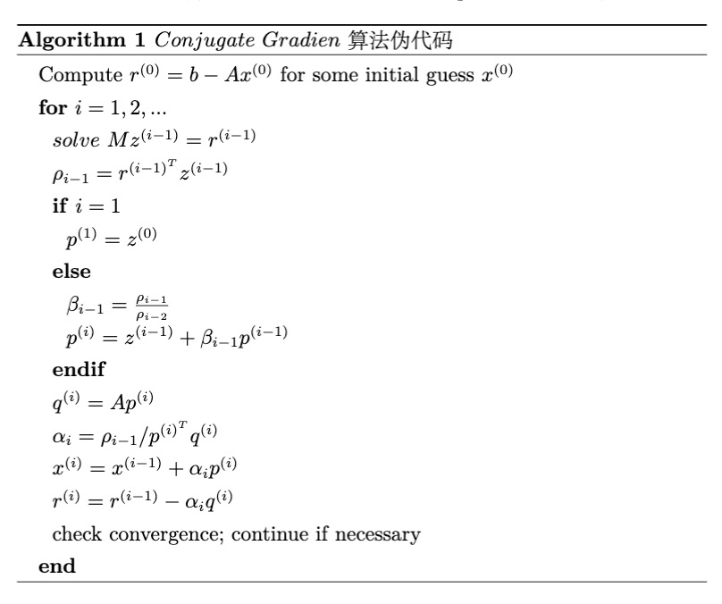
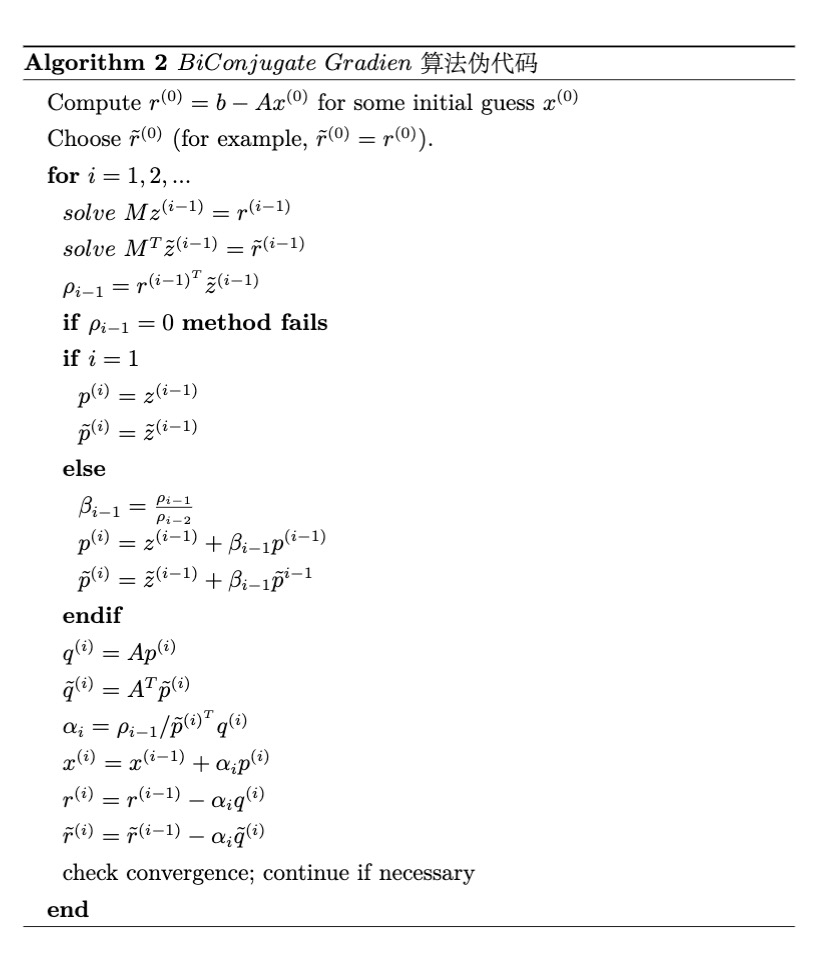
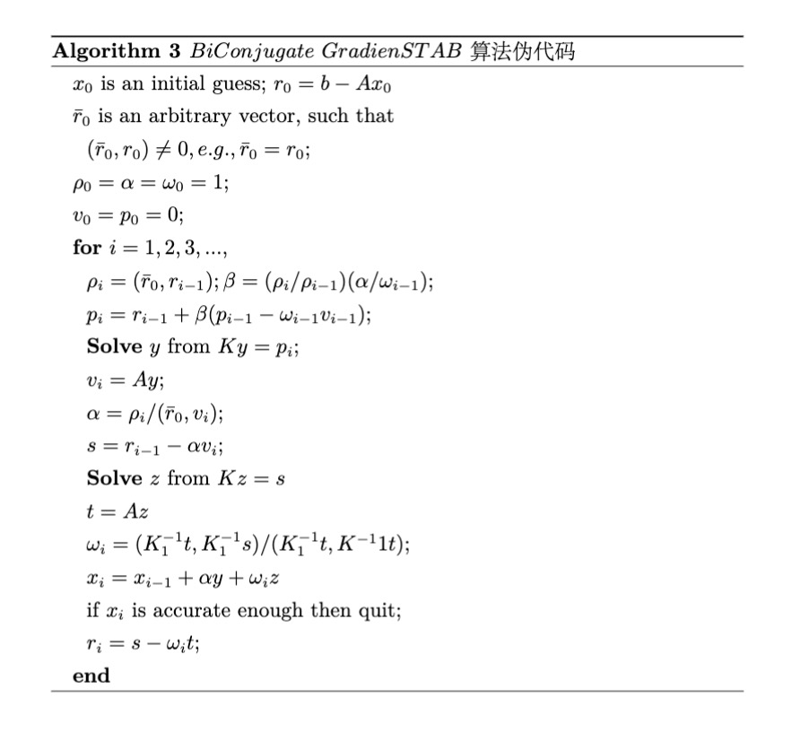
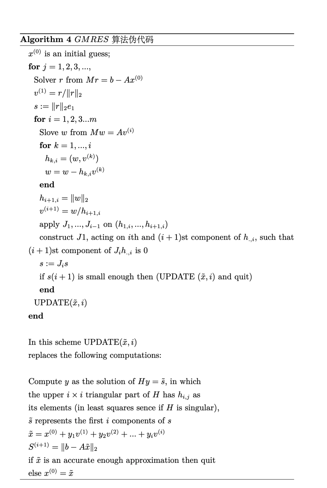

# 快速开始
## 一、编译环境准备
1. Linux系统

目前`ChipSum`仅支持Linux系统

2. CMake 

 `ChipSum`以及第三方库`kokkos`和`kokkos-kernels`的编译, 都需要`Cmake>3.16`，推荐使用`3.20.0`。


3. 获取`ChipSum`代码

```
# get ChipSum
git clone https://gitee.com/chip-sum/ChipSum.git

# get kokkos and kokkos-kernels
cd ChipSum/

git submodule init
git submodule update
```
若您使用成都或昆山超算上使用DCU进行编译和运行，需要将KOKKOS版本切换至3.3.01
```
cd tpls/kokkos
git checkout 
```

## 二、编译
为了方便用户编译，`ChipSum`使用了一个python脚本帮助完成编译过程。已分别在`AMD VEGA906`和`NVIDIA 2080ti`等架构上完成编译并运行。

1 `AMD VEGA906`

```
# AMD Vega906/900  
python3 setup.py arch=VEGA906 compiler=/path/to/your/rocm(i.e. 4.0.1)/bin/hipcc hip=/path/to/your/rocm(i.e. 4.0.1)/hip
```

2 `NVIDIA 2080ti`

```
# NVIDIA 2080ti
python3 setup.py arch=Turing75 cuda=/Path/To/Your/Cuda
```

3 `Volta72`

```
# for Volta72
python3 setup.py cuda=/Path/To/Your/Cuda arch=Volta72
```

4 `MX350(Pascal61)`

```
# for MX350（Pascal61）
python3 setup.py cuda=/Path/To/Your/Cuda arch=Pascal61
```

5 `CPU`编译
根据设备CPU架构输入arch参数，多数情况下为WSM

```

python3 setup.py arch=WSM compiler=g++ j=20
```  

6 其他

若想指定安装目录，可以使用`prefix`参数
```
mkdir /anywhere/you/like
python3 setup.py prefix=/anywhere/you/like
```
 若想指定核编译，可以使用`j`参数
```
python3 setup.py j=32
```
注意：第一次编译时需编译kokkos和kokkos-kernels，耗时较久。后续使用时仅编译ChipSum内容，耗时很快。

## 三、算例
### 1. 验证安装
 `ChipSum`在`test.cpp`中提供了一个简单的用例示范，默认路径编译完成后，可以在`./build`中查看编译结果。
 
```
# default path
cd ./build
./ChipSum
```

预期输出：

```
origin matrix A:
densemat_0_mirror(5,5):
 [0.840188, 0.394383, 0.783099, 0.79844, 0.911647]
 [0, 0.197551, 0.335223, 0.76823, 0.277775]
 [0, 0, 0.55397, 0.477397, 0.628871]
 [0, 0, 0, 0.364784, 0.513401]
 [0, 0, 0, 0, 0.95223]

return expect 0: 0
inverse:A
densemat_0_mirror(5,5):
 [1.19021, -2.37608, -0.244662, 2.71905, -1.75077]
 [0, 5.06197, -3.06314, -6.65166, 4.13262]
 [0, 0, 1.80515, -2.36242, 0.0815571]
 [0, 0, 0, 2.74134, -1.47801]
 [0, 0, 0, 0, 1.05017]

```


### 2. Conjugate Gradient 算例


按默认路径完成编译后，在` ./build/examples/chipsumSolver`路径下存在cg算法的可执行文件，可以实现一个简单的求解算例：

```
cd path_to_chipsum
./build/examples/chipsumSolver/cg
```


### 3. BiConjugate Gradient 算例


按默认路径完成编译后，在` ./build/examples/chipsumSolver`路径下存在BiCG算法的可执行文件，可以实现一个简单的求解算例：

```
cd path_to_chipsum
./build/examples/chipsumSolver/bicg
```


### 4. BiConjugate Gradient STAB 算例


按默认路径完成编译后，在` ./build/examples/chipsumSolver`路径下存在BiCGSTAB算法的可执行文件，可以实现一个简单的求解算例：

```
cd path_to_chipsum
./build/examples/chipsumSolver/bicgstab
```


### 5. GMRES算例


按默认路径完成编译后，在` ./build/examples/chipsumSolver`路径下存在GMRES算法的可执行文件，可以实现一个简单的求解算例：

```
cd path_to_chipsum
./build/examples/chipsumSolver/gmres
```

# 四、应用
我们实现了一个基于`ChipSum`的应用，`chipsumAI`。该应用利用`ChipSum`的函数方法和数据结构等，完成了一个mnist手写体识别样例。该部分将介绍如何编译和运行`chipsumAI`。

### 编译`ChipSum`

首先需要将`ChipSum`编译并make install至指定文件夹

```
cd path_to_chipsum
cd ./build
cmake -DCMAKE_INSTALL_PREFIX=../ ..
make install
```
成功make install后，会在目标文件夹下新生成以下文件。

```
.
├── bin
│   └── ChipSum
├── include
│   ├── chipsum
│   └── ChipSum.hpp
├── lib
│   └── libchipsum.a
```
此时，若需在其他文件中使用`ChipSum`，仅需`#include "ChipSum.hpp"`即可使用相应数据结构和函数。


### 编译`chipsumAI`
在运行手写体识别代码样例前，需要对项目进行编译，已获得可运行的可执行文件。

```
cd path_to_chipsum
cd ./examples/chipsumAI
mkdir build && cd build

# ChipSum_DIR should be absolute path
export ChipSum_DIR=/path/to/chipsum/

cmake -DChipSum_DIR=${ChipSum_DIR} ..

make -j8
```

使用命令`./mnist`运行mnist实现手写体识别，预期输出示例如下：

```
******input is****** : 9
 [                                                       ]
 [                                                       ]
 [                                                       ]
 [                                                       ]
 [                                                       ]
 [                                                       ]
 [                        # # # # # # # #                ]
 [                      # # # # # # # # # #              ]
 [                    # # # # # # # # # # #              ]
 [                    # # # # # # # # # # #              ]
 [                    # # # # #   # # # # #              ]
 [                    # # # # # # # # # # #              ]
 [                      # # # # # # # # # #              ]
 [                      # # # # # # # # # #              ]
 [                          # # # # # # #                ]
 [                          # # # # # #                  ]
 [                        # # # # # # #                  ]
 [                      # # # # # #                      ]
 [                    # # # # # #                        ]
 [                  # # # # # #                          ]
 [                # # # # # # #                          ]
 [                # # # # # #                            ]
 [              # # # # # #                              ]
 [            # # # # # #                                ]
 [              # # # # #                                ]
 [              # # # #                                  ]
 [                                                       ]
 [                                                       ]
*****prediction is***** : 9
```